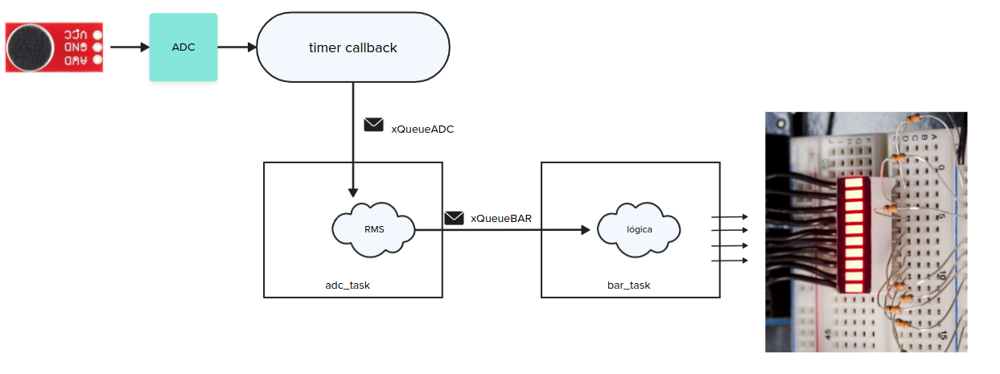

# 24a - AV2 - emb - Intensidade sonora

> LEIA TODOS OS PASSOS ANTES DE SAIR FAZENDO, TENHA UMA VISÃO GERAL DO TODO ANTES DE COMECAR .

Prezadas alunas:

- A prova é prática, com o objetivo de avaliar sua compreensão a cerca do conteúdo da disciplina. 
- É permitido consulta a todo material pessoal (suas anotações, códigos), lembre que você mas não pode consultar outros seres vivos!
- chatgpt / copilot / ... liberados!
- Duração total: 2h 

Sobre a avaliacão:

1. Você deve satisfazer ambos os requisitos: funcional, estrutura de código e qualidade de código para ter o aceite na avaliação;
1. A avaliação de C deve ser feita em sala de aula por um dos membros da equipe (Professor ou Técnico);
1. A entrega do código deve ser realizada no git.
1. Realizar um commit a cada 15 minutos, vamos avisar vocês!

## Entrega

Um sistema embarcado que faz a medićão do volume sonoro e exibe em uma barra de LEDs (a biblioteca queria algo similar a isso), quanto maior o volume mais LEDs são exibidos e quanto mais fraco o som, menos LEDs aparecem acesos na barra.

### Barra de LED

A barra de LED a ser utilizada é essa da sparkfun, que possui 10 LEDs.

- https://www.sparkfun.com/products/9935

E o microfone é esse (use no ADC, como um potenciometro.)

- https://www.sparkfun.com/products/12758

### Detalhes

A leitura do ADC deve ser realizado no `callback` do timer assim como na AVS e na AV2, o dado lido deve ser enviado para a `task_adc` via uma fila. Com os valores do ADC recebidos você deve calcular a energia RMS do sinal de áudio, isso é feito somando N componentes elevadas ao quadrado dividido pelo número de amostras e tirando a raiz quadrada do valor obtido:

A `bar_task` recebe via uma fila o valor do RMS e faz o tratamento para exibicão da potência do áudio na barra de LEDs.

### Configurações

Considere as seguintes configuracoes para a entrega:

- Taxa de amostragem (timer): 1000
- N para o RMS: 500

Com isso vamos obter dois valores de RMS por segundo.

